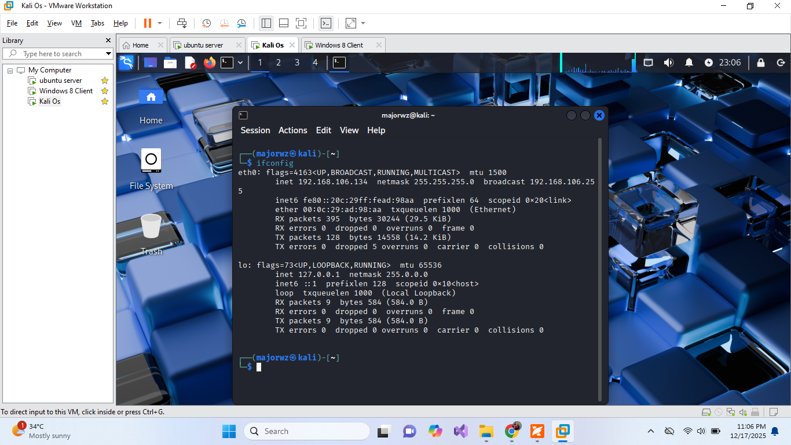
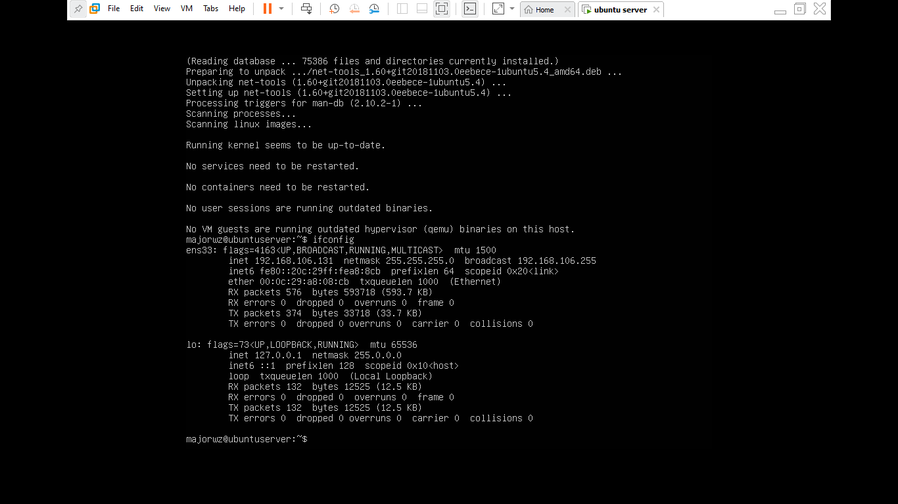
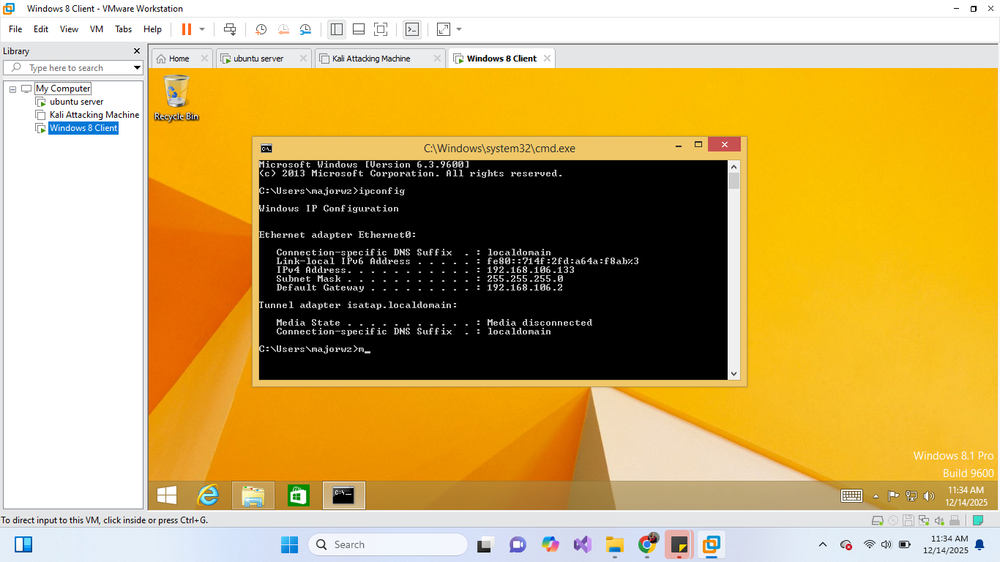

# Virtual Machine Setup

## Virtualization Platform
- VMware Workstation Pro 17
- Host Operating System: Windows 10/11

 
VMWARE Workstation Pro 17 installed interface
---

## Virtual Machines Deployed

### 1. Kali Linux (Attacker)
- Version: Kali Linux 2025.x
- Purpose: Penetration testing and attack execution
- Network Adapter: NAT
- Tools Used: Nmap, Hydra, tcpdump, hping3, Metasploit

Kali Linux Network Adapter set as NAT

### 2. Ubuntu Server (Target)
- Version: Ubuntu Server 22.04 LTS
- Purpose: Hosting vulnerable services
- Network Adapter: NAT
- Services:
  - FTP (vsftpd)
  - SNMP (snmpd)

Ubuntu Server Network Adapter set as NAT

### 3. Windows 8.1 (Client)
- Purpose: Functional validation of services
- Network Adapter: NAT
- Used to confirm service availability before and after attacks

Windows 8.1 Client Network Adapter set as NAT

### 4. Metasploitable 2
- Purpose: Intentionally vulnerable training VM
- Network Adapter: NAT / Host-Only
- Contains known vulnerable services

.png)
Metasploitable 2 Network Adapter set to NAT and Host only
---

## IP Addressing
All machines were assigned IPs within the same private subnet.

| Machine | IP Address |
|------|------|
| Kali | 192.168.106.134 |
| Ubuntu Server | 192.168.106.131 |
| Windows 8.1 | 192.168.106.133 |
| Metasploitable 2 | 192.168.106.135 |

---
- #### Kali OS IP Address
Command: ifconfig
IPV4 Address Output: 192.168.106.134

- #### Ubuntu Server IP Address
Command: ifconfig
IPV4 Address output: 192.168.106.131

- #### Windows 8.1 IP Address
Command: ipconfig
IPV4 Address output: 192.168.106.133 (Default Gateway: 192.168.106.2) 

- #### Metasploitable 2 IP address 
Command: ifconfig
IPV4 Address output: 192.168.106.133 (Default Gateway: 192.168.106.2) 

---

## Connectivity Validation
ICMP ping tests were conducted between all machines to confirm network reachability
before service deployment and attack execution.

